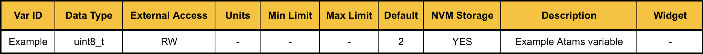
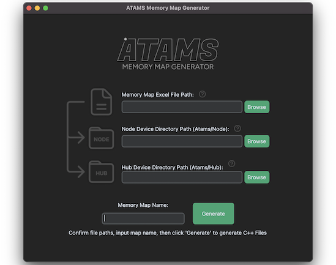

<p align="center">
  
</p>

# Table of Contents

- [Introduction](#introduction)
- [Communications Hardware Requirements](#communications-hardware-requirements)
- [Bus Interoperability](#bus-interoperability)
- [C++ Platform Requirements](#c-platform-requirements)
- [C++ Language Standard](#c-language-standard)
- [Memory Maps](#memory-maps)
- [Memory Map Auto-generation](#memory-map-auto-generation)
- [Memory Map Access](#memory-map-access)
- [Node Library](#node-library)
- [Hub Library](#hub-library)
- [Developer](#developer)
- [License](#license)

# Introduction

Atams is a C++ framework designed for use in embedded systems where a single central device (Hub) communicates with and manages multiple distributed devices (Nodes). It simplifies variable sharing, synchronisation, and non-volatile storage, making it ideal for robotics, automation, and control applications. The aim of Atams is to handle all of the work that gets repeated when creating new embedded devices, allowing users to focus almost entirely on their application specific functionality.

<p align="center">
  
</p>

Atams is split into three sections: Autogen tooling, a Node library, and a Hub library. 

The Atams Hub and Node libraries support the following features:

### Supported Features:

- Type-safe variable exchange with multiple Nodes from a single Hub.
- Support for multiple groups of Nodes on separate buses from a single Hub.
- Optional synchronous processing to ensure all Node variable interactions on the same bus occur simultaneously.
- Support for connecting each Node to multiple buses with different hardware peripherals.
- Dynamic packet generation to fascilitate adaptive variable exchange.
- Packet checksumming and framing to ensure safe variable transport.
- Endianness agnostic variable transport to maximise platform compatibility.
- Hub-triggered saving of selected variables to non-volatile storage on Nodes.
- Hub-triggered restoration of factory defaults to non-volatile storage on Nodes.
- Checksumming and version tracking of Node non-volatile storage.
- Automatic migration of Node non-volatile storage across Memory Map changes — added, removed, renamed, and retyped variables are each handled individually, without losing unrelated stored data.
- Coordination of Memory Map versioning between Node and Hub implementations to ensure safe variable sharing.
- Node watchdog timers to trigger safe state entry should Hub communications fail.
- Hub-triggered communications bitrate changes on Nodes.
- Hub-initiated Node resets.
- Software bus arbitration to avoid messaging conflicts when using hardware without arbitration functionality.
- Zero dynamic memory allocation.

### Not Yet Supported:

- Maximum and minimum value limits for variable storage.
- Large raw buffer transport.

# Communications Hardware Requirements

Atams primarily targets multi-drop buses (such as RS485, CAN FD, CAN XL, 10Base-T1S Ethernet) to simplify wiring in multi-device systems, but can be used on any bus with multi-cast or broadcast capability.

- **Broadcast capability:** All Hub and Node devices must be able to receive all packets transmitted by all other devices on the same Atams Bus. Multi-casting or broadcasting must be available when using non-multi-drop hardware.

> [!NOTE]
>
> For UDP/IP, all devices — Hub and Nodes — should join a single multicast group and send all Atams traffic to it on a shared port. This is required by the [Synchronous Bus Update Cycle](#synchronous-bus-update-cycle) and works equally well for the [Asynchronous Bus Update Cycle](#asynchronous-bus-update-cycle).

- **Self-reception:** Atams safely handles cases where a device receives its own messages.
- **Bus arbitration:** Hardware-level bus arbitration is not required, but can be used alongside Atams software arbitration to improve robustness.
- **Packet size:** Atams is not compatible with hardware that has a small maximum packet size (such as classic CAN). A minimum *maximum* packet size of 64 bytes or greater is recommended.

# Bus Interoperability

Atams uses a custom framing protocol. Bytes from non-Atams devices received on the same bus will corrupt Atams frame detection, causing packets to be lost. For Atams to operate reliably alongside other devices, the Platform layer must ensure that only Atams frames are passed to the Atams receive callback.

How this is achieved depends on the underlying transport:

- **RS485:** No physical-layer addressing or filtering mechanism is available. An RS485 bus cannot be reliably shared with devices using other protocols.
- **CAN FD / CAN XL:** Filter by the CAN ID(s) allocated to Atams traffic before forwarding to the receive callback, using hardware acceptance filters or a software check in the platform's receive handler. Avoid overlapping those CAN IDs with any CANOpen reserved ranges in use on the bus.
- **UDP/IP:** Binding the Platform layer peripheral to a dedicated Atams port gives natural isolation — the IP stack only delivers appropriate matching packets, so no additional filtering is required.

# C++ Platform Requirements

The Atams Hub and Node libraries are compatible with any platform that meets the following requirements:

- Atomic access to variables of type uint32_t must be lock free.
- The size of a float must be 4 bytes and meet the IEC559 standard for binary representation.
- 32-bit and above architecture.

# C++ Language Standard

The Atams Hub and Node libraries are compatible with C++17 and above, do not use any non-ISO C++ features, and are developed with the following compiler flags enabled:  
`-Wall -Wextra -Wpedantic -Wswitch-default -Wunreachable-code -Wformat`

# Memory Maps

Memory Map C++ files are required for operation of the Node and Hub libraries. They provide Atams with the information it needs to initialise and regulate interactions with the Atams variable storage.

### Data Blocks 

Memory Maps are divided into variable groups, or "Data Blocks", to enable users to loosely limit access to certain blocks of variables to specific user files.

- **Variable IDs:** Each of the auto-generated Data Block `.hpp` files includes an enum list of the variable IDs contained within that Block. These variable IDs are used as input arguments to Atams functions to specify variable access.

  ```cpp
  enum VarID_t: uint16_t
  {
    VAR_EXAMPLE_1 = 28U,
    VAR_EXAMPLE_2 = 29U,
    VAR_EXAMPLE_3 = 30U,
  };
  ```
- **Variable Information:** Each Data Block file also contains an array of structs holding information related to each variable. The information includes the variable's type and access permission on both Hub and Node, plus a non-volatile storage option present only in the Node-side generated files — Hub never persists variables to its own storage, so it has no use for that information. Atams is compatible with the following variable types from `<stdint.h>`, as well as floats:

  ```cpp
  uint8_t
  int8_t
  uint16_t
  int16_t
  uint32_t
  int32_t

  float
  ```

### Initialisation Functions 

The Node library Memory Map holds function references used to initialise the Universal Data Block, and restore variable values to factory defaults when required.

### The Universal Data Block

The Universal Data Block is included in all Memory Maps, and is used by the Atams libraries to implement Atams functionality. Hub access to important variables in the Universal Data Block is password protected, preventing accidental changes to key Node configuration values.

### Gen Info 

An Atams::GenInfo_t struct is generated with every Memory Map. This is used to track when the Memory Map files were generated, what Atams version they were generated for, and includes a checksum. This data is used by the Hub library during Bus initialisation to ensure the Hub device and Node device versions of the Memory Map are fully compatible.

```cpp
struct GenInfo_t
{
  uint8_t  atamsVersionMajor  {ATAMS_VERSION_MAJOR};
  uint8_t  atamsVersionMinor  {ATAMS_VERSION_MINOR};
  uint8_t  genDay             {0U};
  uint8_t  genMonth           {0U};
  uint16_t genYear            {0U};
  uint8_t  genHour            {0U};
  uint8_t  genMinute          {0U};
  uint8_t  genSecond          {0U};
  uint32_t genChecksum        {0U};
  uint16_t noOfVars           {0U};
}
```

# Memory Map Auto-generation

A GUI tool is provided for auto-generating the Memory Map C++ files required by the Hub and Node libraries. A single generation run produces both a Node variant and a Hub variant of the Memory Map at the same time — one folder output to `Atams/Node/Maps` for the Node project, and one to `Atams/Hub/Maps` for the Hub project. See [Memory Map Access](#memory-map-access) for how to include the generated files in each project.

### Memory Map Tables



Before using the autogen tool, fill out an Atams Memory Map table in the provided `.xlsx` format to specify the configuration information for each device variable. The table drives code generation and doubles as documentation for the Memory Map. The template is at:  
`Atams/Autogen/TemplateMap.xlsx`.

- **Data Blocks:** Define each Data Block in a separate sheet of the `.xlsx` file. Copy the original template sheet to maintain correct formatting. Sheet names are used as the Data Block name and converted to `PascalCase` namespaces with a `Block` prefix in the generated C++ files.
- **Columns:**

Only `Required` columns must be completed for successful generation. `Optional` columns are used for documentation purposes or to configure factory default and NVM behaviour:

| Column Name     | Requirement  | Description                                                                                          |
| :-------------: | :----------: | :--------------------------------------------------------------------------------------------------: |
| Var Name        | Required     | Name of the device variable. Any format accepted — converted to `SCREAMING_SNAKE_CASE` with a `VAR_` prefix in the `VarID_t` enum. Used as an input argument to Atams functions; keep names concise where possible. Also hashed, together with its Data Block name, to drive [Automatic NVM Migration](#automatic-nvm-migration) — renaming a variable is treated as removing the old one and adding a new one, so its previously stored NVM value is not carried over. |
| Data Type       | Required     | Select from the dropdown list. Atams will return errors if this variable is accessed with a mismatched type. Only the listed types are supported. |
| External Access | Required     | `RO` (Read Only) — Hub can only read this variable. `RW` (Read/Write) — Hub can read and write this variable. |
| Units           | Optional     | Documentation only.                                                                                  |
| Min Limit       | Optional     | Documentation only.                                                                                  |
| Max Limit       | Optional     | Documentation only.                                                                                  |
| Default         | Optional     | Value assigned on startup and during a factory restore. Any value previously stored in non-volatile memory will overwrite this on startup. Zero-initialised if left blank. |
| NVM Storage     | Optional     | Marks the variable for inclusion in a STORE ALL operation. Not stored in non-volatile memory if left blank. |
| Description     | Optional     | Documentation only.                                                                                  |
| Widget          | Future Scope | Reserved for future Atams application compatibility.                                                 |

### Autogen GUI Application

<p align="center">
  
</p>

Follow these steps to generate Memory Map files with the Atams Memory Map Generator GUI.

- **Step 1:** Install the required Python dependencies:

    `pip install -r Atams/Autogen/requirements.txt`
- **Step 2:** Launch the application by running `AtamsAutogen.py` from the `Atams/Autogen` folder.
- **Step 3:** Browse and select the completed Memory Map Table `.xlsx` file for the Node device being developed.
- **Step 4:** Browse and select the Atams Node library path (`Atams/Node`) used by the Node C++ project. A folder named after the Memory Map will be generated at `Atams/Node/Maps/<MapName>/`, containing the Node-specific Memory Map and Data Block files.
- **Step 5:** Browse and select the Atams Hub library path (`Atams/Hub`) used by the Hub C++ project. A matching folder will be generated at `Atams/Hub/Maps/<MapName>/`, containing the Hub-specific variants of the same files. Both folders are created in a single generation run.
- **Step 6:** Enter a name for the Memory Map. Names are converted to `PascalCase` with a `Map` prefix to form the top-level namespace in the generated C++ files (e.g. `Atams::MapExample`).
- **Step 7:** Click *Generate*. Before writing any files, the tool checks whether a folder with the given Memory Map name already exists in either output directory. If a conflict is found, a warning popup will ask for confirmation before overwriting any files. Generation status is shown at the bottom of the application.

> [!NOTE]  
>
> Previously selected file paths are remembered between sessions.

> [!TIP]  
>
> If the Hub and Node are being developed on separate machines, generate Memory Maps to local repositories and use version control to keep them in sync. The Bus Initialisation Process will fail safely if the Hub and Node Memory Maps are incompatible — see [The Bus Initialisation Process](#the-bus-initialisation-process).

# Memory Map Access

Once the Memory Map C++ files have been generated, they are ready to be used in the Node and Hub libraries.

- **Full Map Access:** If a user file needs access to all variables from an Atams Memory Map, it should include the Map file from the associated Map folder found in either `Atams/Node/Maps` for Node projects, or `Atams/Hub/Maps` for Hub projects. 

    Hub example:

  ```cpp
  #include "Atams/Hub/Maps/MapExample/MapExample.hpp"
  ```

    Node example:

  ```cpp
  #include "Atams/Node/Maps/MapExample/MapExample.hpp"
  ```
- **Limited Data Block Access:** If a user file only requires access to a specific Data Block, it should only include the associated Block file found in the associated Map folder.

    Hub example:

  ```cpp
  #include "Atams/Hub/Maps/MapExample/BlockExample1.hpp"
  ```

    Node example:

  ```cpp
  #include "Atams/Node/Maps/MapExample/BlockExample1.hpp"
  ```
- **Variable ID Access:** With the appropriate Map or Block files included, an example variable ID could look like this:

  ```cpp
  Atams::MapExample::BlockExample::VAR_EXAMPLE_1
  ```

    This nested namespace access can result in long variable names. It is recommended to use `using namespace` to access the required Memory Map or Data Block where sensible. Extra care must be taken when using `using namespace` in files that directly, or indirectly, includes multiple Memory Map or Data Block headers. 

  ```cpp
  #include "Atams/Node/Maps/MapExample/BlockExample1.hpp"
  #include "Atams/Node/Maps/MapExample/BlockExample2.hpp"

  uint8_t variableToWrite {0U};

  // Recommended 
  using namespace Atams::MapExample;

  Atams::write(BlockExample1::VAR_EXAMPLE_1, variableToWrite);

  // Not Recommended 
  using namespace Atams::MapExample::BlockExample1;
  using namespace Atams::MapExample::BlockExample2;

  // Variable could belong to BlockExample1 or 2
  Atams::write(VAR_EXAMPLE_1, variableToWrite);
  ```

> [!CAUTION]   
>
> Block-only headers provide a loose access limit — the compiler warns if you reference an ID that doesn't exist in included Map or Data Block headers. When using `using namespace`, be cautious of hidden includes pulling in IDs from other Blocks or Maps. Always aim to use the provided enum IDs rather than raw `uint16_t` values; Atams will return an error if a variable ID is outside of the bounds of the entire Memory Map.

# Node Library

### Getting Started

The steps below show the complete setup sequence for a single-core Node. Each step is documented in detail in the sections that follow.

**Step 1 — Complete the platform files**

Fill in the required function definitions for your hardware and application setup. See [Platform Setup](#platform-setup) for details on which functions apply to your configuration.

```
Atams/Node/SharedPlatform.cpp
Atams/Node/CommsCore/CommsPlatform.hpp
Atams/Node/CommsCore/CommsPlatform.cpp
```

**Step 2 — Include the Comms Core header and Memory Map**

See [Includes & Core Setup](#includes--core-setup).

```cpp
#include "Atams/Node/CommsCore/CommsCore.hpp"
#include "Atams/Node/Maps/MapExample/MapExample.hpp"
```

**Step 3 — Initialise the Comms Core once on startup**

See [Comms Core — Initialisation](#comms-core-single--dual-core).

```cpp
Atams::Error_t nvmStatus  {Atams::ERROR_NONE};
Atams::Error_t initStatus {Atams::ERROR_NONE};

initStatus = Atams::initSingleCore(Atams::MapExample::memoryMap, nvmStatus);
```

**Step 4 — Run the communications update in the main loop**

Call `updateCommsPolling` as often as possible, or `updateCommsBlocking` from a high-priority RTOS thread. See [Communications Update](#communications-update).

```cpp
while (true)
{
  Atams::updateCommsPolling();
}
```

**Step 5 (Optional) — Poll the watchdog fault flag**

If the watchdog is enabled, poll `getWatchdogFault` from application code to detect a Hub communications timeout and enter a safe state. See [Watchdog Fault Handling](#watchdog-fault-handling).

```cpp
if (Atams::getWatchdogFault())
{
  // Enter safe state
}
```

> [!NOTE]
>
> **Dual-core setup:** Steps 1–5 apply to the comms core. On the application core, also complete `Atams/Node/AppCore/AppPlatform.hpp` and `AppPlatform.cpp`, include `Atams/Node/AppCore/AppCore.hpp`, and call `Atams::initAppCore` once before accessing any variables. Use `Atams::initCommsCore` in place of `initSingleCore` on the comms core. See [App Core (Dual-Core Only)](#app-core-dual-core-only).

### Includes & Core Setup

The Node library is compatible with single and dual-core micro-controllers. The user can decide which setup is more appropriate for their use case, but should aim to minimise Atams communications response times for the best Atams Bus performance. See [Maximising Node Performance](#maximising-node-performance).

- **Memory Map Includes:**

    Node library Memory Map files should be included from `Atams/Node/Maps`. See [Memory Map Access](#memory-map-access) for details.
- **Single Core Includes:** 

    If the Atams Node library is used on a single core platform, all Node device functions become accessible with the following header include:

  ```cpp
  #include "Atams/Node/CommsCore/CommsCore.hpp"
  ```

<p align="center">
  
</p>
- **Dual-Core Includes:** 

    If a dual-core setup is used, user application-core files should include the following header:

  ```cpp
  #include "Atams/Node/AppCore/AppCore.hpp"
  ```

    Files running communications-core functions should include the following header:

  ```cpp
  #include "Atams/Node/CommsCore/CommsCore.hpp"
  ```

### Common Return Type

The majority of Node library functions return the following type:

- **Atams::Error_t**  
  This enum type is used to notify the user of any function errors.  
  The following function included from `Atams/Shared/AtamsTypedefs.hpp` converts the error value into a human readable `const char *` string:

  ```cpp
  const char *Atams::getErrorString(const Atams::Error_t error);
  ```

### Comms Core (Single & Dual-Core)

- **Overview:**

    The Comms Core is responsible for updating the Node's communications interface - allowing external Hub devices to access the Node's variable storage, and trigger Node processes. On single-core platforms, user application code can access the variable storage using the Comms Core setter and getter functions.
    
- **Initialisation:** 

    The Comms Core should be initialised with the Memory Map generated for the device-in-development. During initialisation, the Memory Map is validated, before the default values are loaded into the Atams variable storage. If compatible values exist in non-volatile memory (NVM), they are restored - replacing the default values where applicable. If all checks pass, and the init function returns `Atams::ERROR_NONE`, the Comms Core is ready for operation. 

    The NVM restoration status can be checked by passing a second Atams::Error_t variable by reference to the init functions. This error is separated from the main error return, so that the Node can continue to operate if non-volatile storage cannot be restored. Each stored variable is matched against the current Memory Map by name, so ordinary Memory Map changes - adding, removing, renaming, or retyping variables - do not prevent full restoration. Unaffected variables are still restored from non-volatile memory, while a renamed or retyped variable simply starts again from its default value. Restoration only fails outright if the stored data itself was written by an incompatible version of the Atams library or if a Platform layer error occurs.

    There are two versions of the Comms Core init function found in `Atams/Node/CommsCore.hpp`:

    Single-core function:

  ```cpp
  Atams::Error_t initSingleCore(const MemoryMap_t &memoryMap, Atams::Error_t &nvmError)
  ```

    Dual-core function (Dual-core only):

  ```cpp
  Atams::Error_t initCommsCore(const MemoryMap_t &memoryMap, Atams::Error_t &nvmError)
  ```

> [!NOTE]  
>
> The dual-core init function handles synchronisation with the App Core. The function will hang if the App Core init is never run or does not complete successfully.

    Single-core initialisation example:

  ```cpp

  #include "Atams/Node/CommsCore/CommsCore.hpp"
  #include "Atams/Node/Maps/MapExample/MapExample.hpp"

  void userFunc(void)
  {
    Atams::Error_t nvmStatus  {Atams::ERROR_NONE};
    Atams::Error_t initStatus {Atams::ERROR_NONE};

    initStatus = Atams::initSingleCore(Atams::MapTest::memoryMap, nvmStatus);

    if (initStatus != Atams::ERROR_NONE)
    {
      // An error occured during Node initialisation
      printf("Atams Node initialisation error: ");
      printf(Atams::getErrorString(initStatus));
      printf("\n");
    }
    else if (nvmStatus != Atams::ERROR_NONE)
    {
      // An error occured during restoration from non-volatile storage
      printf("Atams non-volatile: ");
      printf(Atams::getErrorString(nvmStatus));
      printf("\n");
    }
  }
  ```

<p align="center">
  
</p>

- **Setting and Getting Variables:** 

    The Node library `Atams::getVar` and `Atams::setVar` functions can be used to read from, and write to, the Atams variable storage from the user application code. The functions will return an error if the Memory Map has not be initialised successfully, if the variable ID is outside of the Memory Map range, or if the template argument variable type does not match the type specified for the variable in the Memory Map. A return of `Atams::ERROR_NONE` indicates a successful transfer.

    **Getter example:**

  ```cpp
  #include "Atams/Node/CommsCore/CommsCore.hpp"
  #include "Atams/Node/Maps/MapExample/MapExample.hpp"

  using namespace Atams::MapExample;

  void userFunc(void)
  {
    Atams::Error_t error {Atams::ERROR_NONE};

    uint32_t exampleVar {0U};

    error = getVar(BlockExample::VAR_ID_EXAMPLE_GET, exampleVar);
  }
  ```

<p align="center">
  
</p>

    **Setter example:**

  ```cpp
  #include "Atams/Node/CommsCore/CommsCore.hpp"
  #include "Atams/Node/Maps/MapExample/MapExample.hpp"

  using namespace Atams::MapExample;

  void userFunc(void)
  {
    Atams::Error_t error {Atams::ERROR_NONE};

    int8_t exampleVar {-1};

    error = setVar(BlockExample::VAR_ID_EXAMPLE_SET, exampleVar);
  }
  ```

<p align="center">
  
</p>

- **Communications Update:** 

    The Atams communications update functions look for, and process, all incoming Bus messages. A single Request Packet from an Atams Hub can include read and write requests for multiple Atams variables. When a Request Packet is received, it is stored for processing at the appropriate time. During processing, the Comms Core validates the request packet, writes received write data to the Atams variable storage, transfers read data from the variable storage into a Response packet, and transmits the Response packet back to the Hub at the appropriate time.

    The polling communications update function can be used in polling application setups. It should be called as often as possible. The longer the delay between calls, the slower the potential response time of the Node device:

  ```cpp
  void updateCommsPolling(void);
  ```

    The alternative blocking update function can be called from a RTOS thread. The function will block the calling thread while waiting to receive new packets. The calling thread priority should be set as high as possible for fast Node response times.

  ```cpp
  void updateCommsBlocking(void);
  ```

<p align="center">
  
</p>

### Automatic NVM Migration

Non-volatile memory (NVM) storage survives ordinary Memory Map changes. Each stored variable is matched against the current Memory Map by name — specifically, a hash of its Data Block name and Var Name (see [Memory Map Tables](#memory-map-tables)) — rather than by its position in the Memory Map. This means adding, removing, reordering, renaming, or retyping variables does not require a factory reset of the rest of the Node's stored data.

| Memory Map Change  | Behaviour on next boot                                                                                                                            |
| :------------------ | :-------------------------------------------------------------------------------------------------------------------------------------------------- |
| Variable unchanged   | Restored from non-volatile memory as normal.                                                                                                         |
| Variable added       | Restored to its default value, the same as any variable seeing non-volatile memory for the first time.                                              |
| Variable removed     | Its stored value is dropped and the space it used is reclaimed.                                                                                      |
| Variable renamed     | Treated as one variable removed and a different variable added — its previous value is not carried over, and it restarts at its default value.      |
| Variable retyped     | Restarts at its default value — a stored value can never be reinterpreted as a different type, even between types of the same size (e.g. `float` and `uint32_t`). |

Migration only affects the specific variables that changed — unrelated variables are restored normally, no matter how many other variables were added, removed, renamed, or retyped in the same update. After a boot that migrates any data, the Node automatically rewrites its non-volatile memory in the current Memory Map's format, so reclaimed space does not accumulate indefinitely.

Restoration only fails outright, resetting every variable to its default value, if the stored data itself is unreadable — for example, if it was written by an incompatible version of the Atams library. Matching is hash-based rather than absolute, so safety-critical stored values should still be validated by the application on startup, independent of NVM status.

### App Core (Dual-Core Only)

- **Overview:**

    For dual-core applications, the App Core hosts the user application code. Setter and getter functions allow the user application code to access the same variable storage as the Comms Core.
- **Initialisation:** 

    The App Core must be initialised using the same Memory Map as the Comms Core. The following function from `Atams/Node/AppCore/AppCore.hpp` is used to initialise the application core. The function will validate the provided Memory Map, and then perform a blocking wait until the Comms Core initialisation completes. The function will return `Atams::ERROR_NONE` if initialisation is successful.

  ```cpp
  Atams::Error_t initAppCore(const MemoryMap_t &memoryMap);
  ```
- **Setting and Getting Variables:**

    The App Core `getVar` and `setVar` functions operate identically to the communications core versions. Atams handles variable storage locks to prevent race conditions from occurring if both cores attempt to access variables simultaneously.

### Platform Setup

The Node library is written to maximise compatibility with different user application setups. This includes single or multi-threaded applications running on single or dual-core microcontrollers, alongside polling or event-driven communications peripheral setups. Atams provides platform files that contain all the required user constants, function declarations, and empty function definitions. The required platform function definitions change depending upon the users application setup. Comments are provided above each constant and function definition to help with implementation. 

- **Platform Files:** 

  The following Node library files need to be completed by the user:

  Single and dual-core:  
  `Atams/Node/SharedPlatform.cpp`  
  `Atams/Node/CommsCore/CommsPlatform.hpp`  
  `Atams/Node/CommsCore/CommsPlatform.cpp`

  Dual-core only:  
  `Atams/Node/AppCore/AppPlatform.hpp`  
  `Atams/Node/AppCore/AppPlatform.cpp`
- **Function Comments:** 

  The following tags are present in the `.cpp` file function comments to indicate when completion of the definition is required. Non-applicable function definitions can be left empty. It is recommended to cast any unused function arguments to `void` to avoid compiler warnings.

| Comment Tag                        | Requirement Condition |
| :--------------------------------- | :---------- |
| ALL                                | Required for all platform setups. |
| MULTI-THREAD                       | Required when Atams functions are used from multiple threads, and/or interrupt contexts, on the given core. |
| DUAL-CORE                          | Required when Atams functions are used on multiple MCU cores. |
| POLLING COMMS                      | Required when the platform hardware needs to be polled in order to receive incoming bytes. |
| EVENT DRIVEN COMMS                 | Required when incoming bytes are received into an interrupt or event context separate from the context running the Atams comms update function. |
| MULTI-THREAD + EVENT DRIVEN COMMS  | Required when Atams::updateCommsBlocking() is used in combination with an event driven receive setup. |

- **Platform Byte Pre-Processing:** 

  No pre-processing of incoming bytes is required at the platform level. All incoming bytes can be passed directly to Atams using the provided receive callback functions. The incoming bytes must be passed to Atams in order, and the same bytes should not be passed to Atams more than once.
- **Platform Reception Methods:** 

  Atams packets are compatible with polling, character delimited, or idle line reception methods. If a user wants to use character delimited reception methods - the delimiter should be set to hex `0x00`. 
- **Shared Memory Configuration (Dual-Core Only):**

  `ATAMS_DUAL_CORE_SHARED_MEMORY_ATTRIBUTE` in `Atams/Node/SharedPlatform.hpp` places the inter-core shared structs into a dedicated memory section. The memory region targeted by this attribute must be configured as **non-cacheable** in the MPU (or equivalent) on both cores. If the region is cacheable, each core may read from its own locally cached copy rather than RAM.
- **Configuration State Callbacks:**

  `enterConfigurationState()` and `exitConfigurationState()` in `CommsPlatform.cpp` are called by the library whenever the Hub initiates a configuration state operation — this includes NVM storage processes, Node resets, and configuration variable changes (Node ID, bitrate, watchdog period). NVM storage and Node resets in particular can block the CPU entirely while they complete.

  `enterConfigurationState()` should return `true` if the application is in a safe state to accept these operations, or `false` to defer them until the next Hub attempt. The application must remain in the safe state until `exitConfigurationState()` is called, which signals that the library will not trigger any further blocking operations or resets until config state is entered again.

> [!WARNING]
>
> Do not return `true` from `enterConfigurationState()` if blocking functions cannot be safely called, or if a Node reset at that moment would cause unacceptable behaviour in the application.

### Watchdog Fault Handling

The Node library includes a software watchdog that measures the time between valid Hub messages. If no valid message is received within the configured watchdog period (set via the Hub's Node Configuration Process), a watchdog fault is triggered. The user application should poll the following function to detect the fault and enter a safe state:

```cpp
bool Atams::getWatchdogFault(void);
```

This function is available from both the Comms Core and App Core — the same call works in either context. It returns `true` when a fault is active.

The watchdog counter is reset automatically each time a valid Hub message is received, so no user action is required to keep the watchdog fed during normal operation.

> [!IMPORTANT]
>
> The watchdog fault does **not** clear automatically when Hub communications resume. Once a fault is active, it persists until the Hub explicitly clears it. Use `NodeActions::beginClearWatchdogFault` / `updateClearWatchdogFault` from the Hub Library to perform the clear — see [Node Actions](#node-actions) in the Hub Library section. The `VAR_WATCHDOG_FAULT_ACTIVE` variable in the Universal Data Block is also set when a fault is active, allowing the Hub to detect the fault state on reconnection.

> [!NOTE]
>
> Set the watchdog period to `0` in the Node Configuration to disable the watchdog entirely. See [The Node Configuration Process](#the-node-configuration-process).

### Maximising Node Performance

The non-blocking comms update function (`Atams::updateCommsPolling()`) returns immediately on each call, relying on the user to poll it as frequently as possible. The faster the poll rate, the less time elapses between a request arriving and the Node processing and responding to it.

The blocking variant (`Atams::updateCommsBlocking()`) suspends the calling thread until a packet arrives or a timeout expires, freeing the CPU to do other work between requests. For the lowest response latency, the thread running `updateCommsBlocking()` should be given higher priority than any user functions that could otherwise delay it. If priority constraints make this difficult, dedicating a secondary core of a multi-core MCU to Atams communications is an alternative. Minimising Node response latency becomes especially important when using the [Synchronous Bus Update Cycle](#synchronous-bus-update-cycle).

### Building (CMake Example) - Coming Soon

### Building (STM32CubeIDE Dual-Core Example) - Coming soon

# Hub Library

<p align="center">
  
</p>

The Hub library includes two key classes: a Node class, and a Bus class. 

**Node Class:** The Hub device user code needs to construct a Node class instance for each physical Node connected to the Hub. The Node class public interfaces allow the user to set and get variables stored in a Node instances variable storage. It also allows users to control the method and frequency by which the variables are transferred to and from the variable storage on the physical Node device.

**Bus Class:** A Bus class instance is required to enable communication and variable exchange with connected Node devices. Each Node class instance must be linked to the Bus instance that mirrors the physical device connections. The Bus class public interfaces include easy to update processes - abstracting away packet handling, compatibility checks, Node storage processes, Bus arbitration, Node configuration, Node sychronisation, and error handling. This lets the user focus almost entirely on their application specific functionality.

### Getting Started

The steps below show the complete sequence for setting up and running the Hub library. Each step is documented in detail in the sections that follow.

**Step 1 — One-time Node configuration** (new or reconfigured Nodes only)

Each physical Node device must be assigned a unique ID before it can be used on the Bus. See [The Node Configuration Process](#the-node-configuration-process).

**Step 2 — Construct Node and Bus instances**

See [Bus Construction](#bus-construction) and [Node Construction](#node-construction).

```cpp
#include "Atams/Hub/Node.hpp"
#include "Atams/Hub/Bus.hpp"
#include "Atams/Hub/Maps/MapExample/MapExample.hpp"

static const Atams::Platform::BusPeripheral::UserData_t userData { /* ... */ };

static Atams::Bus  bus(userData);
static Atams::Node node1(1U);
static Atams::Node node2(2U);
```

**Step 3 — Initialise each Node instance with its Memory Map**

See [Node Initialisation](#node-initialisation).

```cpp
node1.init(Atams::MapExample::memoryMap);
node2.init(Atams::MapExample::memoryMap);
```

**Step 4 — Add each Node to the Bus**

See [Linking Nodes to a Bus](#linking-nodes-to-a-bus).

```cpp
bus.addNodeToBus(node1);
bus.addNodeToBus(node2);
```

**Step 5 — Run the Bus Initialisation Process** (once per power cycle, or when the Bus configuration changes)

See [The Bus Initialisation Process](#the-bus-initialisation-process).

```cpp
Atams::Error_t        error {Atams::ERROR_NONE};
Atams::ProcessState_t state {Atams::PROCESS_IN_PROGRESS};

error = bus.beginBusInitProcess();

do    
{
  state = bus.updateBusInitProcess(error); 
}
while (state == Atams::PROCESS_IN_PROGRESS);
```

**Step 6 — Configure Request Patterns for variables to read or write**

`setRequestPattern` controls which variables are included in each update cycle and whether they are read or written. For writes, call `setVar` first to place the value into the Node instance's local storage. Helper functions such as `setReadStream` and `setWriteStream` provide cleaner syntax for the most common patterns — see [Node Request Pattern Control](#node-request-pattern-control).

```cpp
using namespace Atams::MapExample;

// Request a read of VAR_EXAMPLE_1 every update cycle
node1.setRequestPattern(BlockExample::VAR_EXAMPLE_1, Atams::ACCESS_READ, Atams::REQUEST_STREAM);

// Place a write value into local storage, then request it be sent every update cycle
node1.setVar(BlockExample::VAR_EXAMPLE_2, someValue);
node1.setRequestPattern(BlockExample::VAR_EXAMPLE_2, Atams::ACCESS_WRITE, Atams::REQUEST_STREAM);
```

**Step 7 — Run the Bus Update Cycle** (called repeatedly in the application loop)

See [Synchronous Bus Update Cycle](#synchronous-bus-update-cycle) or [Asynchronous Bus Update Cycle](#asynchronous-bus-update-cycle).

```cpp
error = bus.beginUpdateCycle();

do 
{ 
  state = bus.runUpdateCycleSync(error); 
}
while (state == Atams::PROCESS_IN_PROGRESS);

bus.processResponseBuffers();
```

**Step 8 (Optional) — Check New Data Ready and Write Acknowledgement flags**

Each variable has a New Data Ready flag set when fresh read data arrives, and a Write Acknowledgement flag set when a write is confirmed by the Node. Both flags persist until explicitly cleared. They are useful for per-variable confirmation independent of the overall cycle result, and particularly valuable when the Bus Update Cycle runs in a separate thread from the code reading or writing variables. See [Node Acknowledgement and New Data Ready Flags](#node-acknowledgement-and-new-data-ready-flags).

```cpp
// using namespace Atams::MapExample assumed
bool newData  {false};
bool writeAck {false};

node1.isDataReady(BlockExample::VAR_EXAMPLE_1, newData);
node1.isWriteAcked(BlockExample::VAR_EXAMPLE_2, writeAck);
```

**Step 9 — Read updated variable values from Node instance storage**

If the update cycle and `processResponseBuffers` both return without error, all active read requests received fresh data and all active write requests were acknowledged by the Node. Variable values can be read directly from Node instance storage using `getVar`. See [Node Variable Access](#node-variable-access).

```cpp
uint32_t readValue {0U};
node1.getVar(BlockExample::VAR_EXAMPLE_1, readValue); // using namespace Atams::MapExample assumed
```

> [!NOTE]
>
> **Commissioning (Step 1):** The Node Configuration Process writes the Node's configuration to its non-volatile memory, so it only needs to be run once when commissioning a new Node device, or when a configuration change is required. It is not part of the normal operational flow.
>
> **Power-on setup (Steps 2–5):** These steps must be run every time the Hub is powered on or the Hub library is initialised.
>
> **Main loop (Steps 6–9):** Request Patterns only need to be changed when the set of variables being exchanged changes. Steps 7 and 9 form the core repeating loop; Step 8 is optional and most valuable in multi-threaded setups.

### Common Return Types

The majority of Hub library functions return one of the two following types:

- **Atams::Error_t**

This enum type is used to notify the user of any function or process errors.  
The following function included from `Atams/Shared/AtamsTypedefs.hpp` converts the error value into a human readable `const char *` string:

```cpp
const char *getErrorString(const Atams::Error_t error);
```

- **Atams::ProcessState_t**

This enum type is returned from any Atams function that includes a polled update process. The enum options are as follows:

```cpp
    enum ProcessState_t: uint8_t
    {
      PROCESS_ERROR       = 0U, /* - The process reached an error condition and has stopped.
                                 * - Check the Atams::Error_t passed to the process update function for error details. 
                                 * - Restart the process using the appropriate `begin` function if required.
                                 */

      PROCESS_IN_PROGRESS = 1U, /* - The process is in progress, keep polling the process update
                                 *   function until either PROCESS_ERROR or PROCESS_COMPLETE is returned.
                                 */

      PROCESS_COMPLETE    = 2U  /* - The process has completed successfully.
                                 * - Restart the process using the appropriate `begin` function if required.
                                 */
};
```

  When a process returns `Atams::PROCESS_ERROR`, the library automatically cleans up its internal state — no manual teardown is required. The process can be restarted at any time by calling the appropriate `begin...` function again.

### Includes

- **Memory Map Includes:**

    Hub library Memory Map files should be included from `Atams/Hub/Maps`. See [Memory Map Access](#memory-map-access) for details.
- **Node Access Includes:**

    Files responsible for initialising or accessing a Node instance should include the following header:  
  `Atams/Hub/Node.hpp`
- **Bus Control Includes:**

    Files responsible for initialising and updating the Bus must include the following headers:  
  `Atams/Hub/Node.hpp`  
  `Atams/Hub/Bus.hpp`

### Bus Construction

The Atams Bus constructor accepts an `Atams::Platform::BusPeripheral::UserData_t` instance. When the user completes the definition of the `Atams::Platform::BusPeripheral` class in the Hub Platform files, they may need to access data that is set, or objects that are constructed, at a wider application scope. Any variables or references that need to be used by the `BusPeripheral` class can be added to the `BusPeripheral::UserData_t` definition, and passed to the class during construction.

**Example:**

The following example uses Asio - a common cross-platform C++ library for network and low-level I/O programmin
g . Asio is not part of the Atams libraries and is used as an example low level interface only.

```cpp
// In the Atams::Platform::BusPeripheral class definition in Hub/Platform.hpp:
struct UserData_t
{
  // Example contents
  asio::io_context  &ioContext;
  asio::serial_port &serialPort;
};

// In the user application setup files:
static asio::io_context  ioContext;
static asio::serial_port serialPort(ioContext);

static const Atams::Platform::BusPeripheral::UserData_t userData 
{
  .ioContext  {ioContext},
  .serialPort {serialPort}
};

static Atams::Bus bus(userData);
```

### The Node Configuration Process

Before a Node device can be used with the Hub library, the user must set up the Node configuration. The Node configuration is saved to non-volatile memory on the Node device during the Node Configuration Process, so the process only needs to be run once when a new Node device is being commissioned, or when a change to the Node configuration is required.

```cpp
struct NodeConfig_t
{
  uint8_t                currentNodeID;
  uint8_t                newNodeID;
  Atams::BitrateOption_t bitrateOption;
  uint32_t               watchdogPeriod;
};
```

- **Node ID:**

The Node configuration includes the unique Node ID used for Node addressing during the Bus update cycle. Each physical Node on an Atams Bus must be configured with it's own unique ID ranging from 1-254. All unconfigured Nodes will start with a Node ID of 0.

- **Bitrate Option:**

How the Bitrate Option affects the Node's hardware peripheral bitrate is defined by the developer of the Node device in the Node library platform setup. All Node's on the same bus must have the same hardware peripheral bitrate as a result of setting each of the Node's Bitrate Options.

- **Watchdog Period:**

The Node library measures the time between messages received from the Hub. If the time spent waiting for a new message exceeds the watchdog period, the Node library will alert the Node device user code so the device can enter a safe state. The period is measured in milliseconds. Set the value to 0 to disable the watchdog functionality.

- **Hardware Connections:**

If multiple unconfigured Node's need to be added to a physical bus, they must be physically connected and configured one by one. If a Node already has a unique ID, it can be re-configured without having to remove any other Nodes from the bus, so long as the new Node ID does not conflict with an existing Node ID on the bus.

- **Starting the Configuration Process:**

The following example shows how to start the Node Configuration Process for an un-configured Node on the bus.

```cpp
#include "Atams/Hub/Bus.hpp"

constexpr uint8_t NODE_ONE_ID {1U};

static const Atams::Platform::BusPeripheral::UserData_t userData;

static Atams::Bus bus(userData);

void userFunc(void)
{
  Atams::NodeConfig_t nodeConfig 
  { 
    0U,                      // Current Node ID 
    NODE_ONE_ID,             // New Node ID
    Atams::BITRATE_OPTION_0, // Bitrate option
    0U                       // Disable watchdog
  };

  Atams::Error_t error {Atams::ERROR_NONE};

  error = bus.beginSetNodeConfigProcess(nodeConfig);
}
```

- **Updating the Configuration Process:**

The process writes the new configuration to the Node and triggers an NVM storage operation to persist it between power cycles. The update function returns `Atams::PROCESS_COMPLETE` on success, or `Atams::PROCESS_ERROR` if any step fails — check the `Atams::Error_t` passed by reference for details.

  **Example:**

```cpp
#include "Atams/Hub/Bus.hpp"

static const Atams::Platform::BusPeripheral::UserData_t userData;

static Atams::Bus bus(userData);

void userFunc(void)
{
  Atams::Error_t        error {Atams::ERROR_NONE};
  Atams::ProcessState_t processState;

  do 
  {
    processState = bus.updateSetNodeConfigProcess(error);
  }
  while (processState == Atams::PROCESS_IN_PROGRESS);
}
```

### Node Construction

If all Node's on the Bus are appropriately configured (See [Node Configuration](#node-configuration)), Node class instances can be constructed using their unique Node ID. The ID can be changed at runtime using the Node class `setNodeID` function, but keep in mind that the Node device must be re-configured before changing the Node ID of the Node class instance.

**Example:**

```cpp
#include "Atams/Hub/Node.hpp"
#include "Atams/Hub/Maps/MapExample/MapExample.hpp"

constexpr uint8_t NODE_ONE_ID {1U};

static Atams::Node node1 (NODE_ONE_ID);
```

<p align="center">
  
</p>

### Node Initialisation

Each Node class instance needs to be initialised with a Memory Map from `Atams/Hub/Maps` that was generated with the Memory Map used to initialise the associated Node device. If a valid Memory Map is provided to the initialisation function, the function will return `Atams::ERROR_NONE`.

**Example:**

```cpp
#include "Atams/Hub/Node.hpp"
#include "Atams/Hub/Maps/MapExample/MapExample.hpp"

constexpr uint8_t NODE_ONE_ID {1U};

static Atams::Node node1(NODE_ONE_ID);

void userFunc(void)
{
  Atams::Error_t error {Atams::ERROR_NONE};
  
  error = node1.init(Atams::MapExample::memoryMap);
}
```

<p align="center">
  
</p>

### Linking Nodes to a Bus

The Bus class `addNodeToBus` function needs to be used to link each Node class instance to a Bus instance. This allows the Bus instance to control the transfer of request and response packets between the Node class instances and the physical Node devices during Bus update cycles. The `addNodeToBus` function will return errors if the Node has already been added to the Bus, or if the Bus is full.

**Example**

```cpp
#include "Atams/Hub/Node.hpp"
#include "Atams/Hub/Maps/MapExample/MapExample.hpp"

constexpr uint8_t NODE_ONE_ID {1U};

static const Atams::Platform::BusPeripheral::UserData_t userData;

static Atams::Bus  bus(userData);
static Atams::Node node1(NODE_ONE_ID);

void userFunc(void)
{
  Atams::Error_t error {Atams::ERROR_NONE};
  
  error = bus.addNodeToBus(node1);
}
```

<p align="center">
  
</p>

### The Bus Initialisation Process

Atam's uses packets that are dynamically adjusted at runtime. For this to work safely, the Hub device must confirm that the version of the Memory Map it holds for each initialised Node class instance is fully compatible with the version of the Memory Map used to initialise each Node device on the physical Bus.

Additionally, the Synchronous Bus Update Cycle is designed to use the Bus as efficiently as possible. For this to work, each Node needs to be aware of the Node IDs of the first, last, and previous Node's on the same Bus.

The Bus Initialisation Process handles Memory Map compatibility checking, and storage of the necessary Node IDs into the Node device Universal Data Blocks. The process is simple to start and update, and it ensures the Bus Update Cycles are safe and time efficient. As long as the Bus configuration has not changed, the Bus Initialisation Process will be significantly quicker after the first successful completion.

The Bus Initialisation process cannot be skipped, and must be completed to use the Bus Update Cycles.

- **Starting the Bus Initialisation Process:**

The following example shows how to start the Bus Initialisation Process. The function will return errors if no Node class instances have been added to the Bus, or if the `BusPeripheral::startReceive()` function fails to complete successfully.

```cpp
#include "Atams/Hub/Bus.hpp"

static const Atams::Platform::BusPeripheral::UserData_t userData;

static Atams::Bus bus(userData);

void userFunc(void)
{
  Atams::Error_t error {Atams::ERROR_NONE};

  error = bus.beginBusInitProcess();
}
```

- **Updating the Bus Initialisation Process:**

  The process verifies Memory Map compatibility and synchronises required configuration across all Nodes on the Bus. If any compatibility check fails, an NVM operation fails, or a communications error occurs, the update function will return `Atams::PROCESS_ERROR`. The error variable passed by reference will be set with further details.

  **Example:**

  ```cpp
  #include "Atams/Hub/Bus.hpp"

  static const Atams::Platform::BusPeripheral::UserData_t userData;

  static Atams::Bus bus(userData);

  void userFunc(void)
  {
    Atams::Error_t        error {Atams::ERROR_NONE};
    Atams::ProcessState_t processState;

    do 
    {
      processState = bus.updateBusInitProcess(error);
    }
    while (processState == Atams::PROCESS_IN_PROGRESS);
  }
  ```

<p align="center">
  
</p>

### Node Request Pattern Control

- **Node Request Packets:**

  Each Node class instance owns a Request Packet. This is a runtime adjusted packet sent to the Node devices during the Bus update cycle. The payload of the Request Packet is initially empty, and varies depending upon the Request Pattern settings for each Node variable.
- **Request Packet Datagrams:**

  Each variable with an active Request Pattern will have a datagram in the Node Request Packet. When sent to the Node device, a Read Datagram in a Request Packet will trigger the external Node device to return it's stored variable value in it's Response Packet. Similarly, a Write Datagram in a Request Packet, will trigger the external Node device to store the received value in it's variable storage, and return a write acknowledgement to the Hub.
- **How to Change Request Patterns:**

  Request Pattern and Access controls determine which datagrams are added to or removed from the Node instance's Request Packet. The Request Packet cannot contain a Read Datagram and a Write Datagram for the same variable simultaneously. The following Node class function is used to set the Request Pattern for a given variable.

  ```cpp
  Atams::Error_t setRequestPattern(const uint16_t         varID,
                                   const Atams::Access_t  accessRequest,
                                   const RequestPattern_t requestPattern);
  ```

  The Request Pattern and Access options have the following effects:

  ```cpp

  enum Access_t: uint8_t
  {
    ACCESS_NONE  = 0U, // Remove any existing datagram for this variable.

    ACCESS_READ  = 1U, // Add a Read Datagram for this variable to the Node Request Packet. 
                       // If a Write Datagram exists, it will be replaced.

    ACCESS_WRITE = 2U, // Add a Write Datagram for this variable to the Node Request Packet. 
                       // If a read Datagram exists, it will be replaced.
  };

  enum RequestPattern_t: uint8_t
  {
    REQUEST_INACTIVE   = 0U, // Remove any existing Datagram for this variable.

    REQUEST_STREAM     = 1U, // The Datagram will remain in the Node Request Packet until explicitly cleared or changed.

    REQUEST_UNTIL_ACK  = 2U, // Add the Datagram to the Node Request Packet until a write 
                             // acknowledgement or new read data is received.
  };

  // Note: If either ACCESS_NONE or REQUEST_INACTIVE are used, the Request Packet datagram will be removed regardless of other inputs.
  ```

<p align="center">

</p>

- **Helper Function:**

Helper functions are provided to clean up the syntax for setting Request Patterns. They can be used to call the Node class `setRequestPattern` function with pre-determined arguments:

```cpp
// ACCESS_WRITE + REQUEST_UNTIL_ACK + Node::setVar
template <typename T>
Atams::Error_t setWriteUntilAck(const uint16_t varID, const T writeValue);

// ACCESS_READ + REQUEST_UNTIL_ACK
Atams::Error_t setReadUntilAck(const uint16_t varID);

// ACCESS_WRITE + REQUEST_STREAM
Atams::Error_t setWriteStream(const uint16_t varID);

// ACCESS_READ + REQUEST_STREAM
Atams::Error_t setReadStream(const uint16_t varID);

// ACCESS_NONE + REQUEST_INACTIVE
Atams::Error_t stopStream(const uint16_t varID);
```

### Node Variable Access

The Node class `getVar` and `setVar` functions can be used to read from, and write to, a Node instances variable storage from the user application code. The functions will return an error if the Node instance has not be initialised successfully, if the variable ID is outside of the Node instance's Memory Map range, or if the template argument variable type does not match the type specified in the Memory Map. A return of `Atams::ERROR_NONE` indicates a successful transfer.

**Setter example:**

```cpp
using namespace Atams::MapExample;

void userFunc()
{
  uint32_t exampleVarToSet {23U};

  Atams::Error_t error {Atams::ERROR_NONE};

  error = setVar(BlockExample::VAR_ID_EXAMPLE_SET, exampleVarToSet);
}
```

<p align="center">
  
</p>

**Getter example:**

```cpp
using namespace Atams::MapExample;

void userFunc()
{
  int16_t exampleVarToGet {0};

  Atams::Error_t error {Atams::ERROR_NONE};

  error = getVar(BlockExample::VAR_ID_EXAMPLE_SET, exampleVarToGet);
}
```

<p align="center">
  
</p>

### Node Acknowledgement and New Data Ready Flags

The Node class variable storage holds Write Acknowledgement and New Data Ready flags for each variable. If a Node device Response Packet acknowledged that data was written to a given variable, that variable's Write Acknowldgement Flag is set. If the Response Packet contained new variable data that was successfully copied into the Node instances variable storage, the New Data Ready Flag is set. 

The flags can be retrieved with the following functions:

```cpp
Atams::Error_t isWriteAcked(const uint16_t varID, bool &ackReceived);
Atams::Error_t isDataReady(const uint16_t varID, bool &newDataReady); 
```

The flags can be cleared with the following functions:

```cpp
Atams::Error_t clearWriteAck(const uint16_t varID);
Atams::Error_t clearDataReady(const uint16_t varID);
```

The functions will return an error if the varID is outside the bounds of the Memory Map used to initialise the Node instance. Both flags persist across Bus Update Cycles until explicitly cleared — they are not automatically reset between cycles.

### Node Combined Convenience Functions

The Node class contains convenience functions to clean up the syntax for compounding operations. The helper functions use a combination of the Request Pattern setter, variable setter/getter, and flag checking/clearing functions to help keep user code clean.

Examples:

```cpp
// clearDataReady + ACCESS_READ + REQUEST_PATTERN_STREAM;
Atams::Error_t clearDataReadySetReadStream(const uint16_t varID)

// isDataReady + ACCESS_NONE + REQUEST_PATTERN_INACTIVE
Atams::Error_t stopStreamIsDataReady(const uint16_t varID, bool &newDataReady);

// isDataReady + getVar (if new data is ready)
// Function will return Atams::ERROR_NEW_DATA_NOT_READY if new data is not ready
template <typename T>
Atams::Error_t getVarIfDataReady(const uint16_t varID, T &outputRef);

// ACCESS_NONE + REQUEST_PATTERN_INACTIVE + isDataReady + getVar (if new data is ready)
// Function will return Atams::ERROR_NEW_DATA_NOT_READY if new data is not ready
template<typename T>
Atams::Error_t stopStreamGetVarIfDataReady(const uint16_t varID, T &readData);

// clearWriteAck + ACCESS_WRITE + REQUEST_PATTERN_STREAM
template<typename T>
Atams::Error_t clearAckSetWriteStream(const uint16_t varID, const T writeData);

// ACCESS_NONE + REQUEST_PATTERN_INACTIVE + isWriteAcked
Atams::Error_t stopStreamGetWriteAck(const uint16_t varID, bool &ackReceived);
```

### Synchronous Bus Update Cycle

- **Overview**

  During the Synchronous Update Cycle, Request Packets are sent to all Node devices, which store them in a Sync Buffer. Once the final Node device receives it's Request Packet, all Nodes process their stored Sync Buffers simultaneously: variables are written to variable storage, and read data and write acknowledgments are transferred to Response Packets. The first Node transmits it's Response Packet immediately, and each subsequent Node device transmits it's response after receiving the previous Node's Response Packet. If a Node does not respond within a given timeout window, the Bus Update Cycle running on the Hub, detects the timeout and sends a Jog Packet to the next Node device in the response order, ensuring the cycle continues.

  The Bus Update Cycles do not process incoming response data during the update. This is triggered by the user once the update cycle is complete with the `Bus::processResponseBuffers` function.
- **Starting the Synchronous Update Cycle:**

  The `Bus::beginUpdateCycle(void)` function is used to start an update cycle. On calling the function, write values for each Node instance on the Bus are transferred from variable storage into the Request Packets. If a variable's Request Pattern has been set to Write Stream, the user only needs to ensure that the most recent data was written to the Node instance variable storage using the Node `setVar` function. The function will return errors if the Bus has not been initialised or if a Bus Update Cycle is already in progress.

  The begin function also clears any previously asserted Bus errors stored in the Node instances from previous Update Cycles.

  Example:

  ```cpp
  #include "Atams/Hub/Bus.hpp"

  static const Atams::Platform::BusPeripheral::UserData_t userData;

  static Atams::Bus bus(userData);

  void userFunc(void)
  {
    Atams::Error_t error {Atams::ERROR_NONE};

    error = bus.beginUpdateCycle();
  }
  ```

<p align="center">
  
</p>

- **Updating the Synchronous Update Cycle Example:**

  The `runUpdateCycleSync(Atams::Error_t &error)` function is used to update the Bus Update Cycle. The function will not return errors that occur for any single Node during the Update Cycle. If communications errors occur with specific Nodes, they will be logged and accessible after the Update Cycle has completed.

  ```cpp
  #include "Atams/Hub/Bus.hpp"

  static const Atams::Platform::BusPeripheral::UserData_t userData;

  static Atams::Bus bus(userData);

  void userFunc(void)
  {
    Atams::Error_t        error {Atams::ERROR_NONE};
    Atams::ProcessState_t processState;

    do 
    {
      processState = bus.runUpdateCycleSync(error);
    }
    while (processState == Atams::PROCESS_IN_PROGRESS);
  }
  ```

<p align="center">
  
</p>

- **Processing Response Packets & Handling Errors:**

  If the Sychronous Update Cycle completes successfully, each Node class instance linked to the Bus will contain a new Response Packet. The user can call the `Bus::processResponseBuffers` to trigger the processing of all Node Response Packets. If the function returns no errors, all the read values received from all the Node devices will be written to the Node class instances' variable storage, and the data ready and write acknowledgement flags will be set appropriately. If communications errors occured with any of the Nodes during the Bus Update Cycle, this function will return an error. 

  If `Bus::processResponseBuffers` returns an error, a communications failure occurred on one or more Nodes but the function does not identify which. Call `getBusError()` on each Node instance to find the affected Node and the specific failure — variable storage for that Node may not have been updated for that cycle. Bus errors are automatically cleared when `beginUpdateCycle` is next called, so check them before starting the next cycle.

  **Example:**

  ```cpp
  #include "Atams/Hub/Node.hpp"
  #include "Atams/Hub/Bus.hpp"

  static const Atams::Platform::BusPeripheral::UserData_t userData;

  enum NodeID_t: uint8_t
  {
    NODE_1_ID = 1U,
    NODE_2_ID = 2U,
    NUMBER_OF_NODES
  }

  static Atams::Node node1(1);
  static Atams::Node node2(2);

  static Atams::Node[NUMBER_OF_NODES] *nodePtrs {&node1, &node2};

  static Atams::Bus bus(userData);

  void userFunc(void)
  {
    Atams::Error_t error {Atams::ERROR_NONE};

    error = bus.processResponseBuffers();

    if (error == Atams::ERROR_NONE)
    {
      printf("Response Packet processing successful! \n");
    }
    else
    {
      // A Bus error occured with one or more Nodes
      for (Atams::Node *&node : nodePtrs)
      {
        // Check this Node for error
        error = node->getBusError();
      }
    }
  }
  ```

<p align="center">
  
</p>

- **Aborted Responses:**

  Most Bus errors — such as timeouts, framing errors, and checksum failures — are transient and indicate a communications issue that is likely to resolve on the next update cycle. One error type is more serious and warrants immediate attention: `ERROR_ABORTED_RESPONSE`.

  An aborted response means the Node received a Request Packet that passed framing and checksum validation, but encountered an error while parsing or validating its datagrams. The Node aborts its response at the point of the offending datagram and reports the error. This is distinct from a communications failure — the packet was received and decoded successfully, but its datagram content was invalid from the Node's perspective.

  The most likely cause of an aborted response is a mismatch between the Hub and Node Memory Maps. If the Hub's Memory Map and the Node's Memory Map were not generated from the same source, the Hub may request access to a variable that does not exist on the Node, or attempt to write to a variable the Node considers read-only. The Bus Initialisation Process checks Memory Map compatibility — an aborted response in normal operation indicates that the Hub's Request Packet contains a datagram that shouldn't have been possible to construct. This points to a programming error rather than a transient communications issue.

  When `getBusError()` returns `ERROR_ABORTED_RESPONSE`, call `getAbortedResponseDetails()` on the same Node instance to retrieve the variable ID of the datagram that caused the abort and the specific error:

  ```cpp
  Atams::AbortedResponseDetails_t getAbortedResponseDetails(void);
  ```

  ```cpp
  struct AbortedResponseDetails_t
  {
    uint16_t       varID; // ID of the variable whose datagram triggered the abort; VAR_ID_NULL if not applicable
    Atams::Error_t error; // Reason the Node rejected the datagram
  };
  ```

  The `error` field will be one of the following:

  | Error                          | varID            | Meaning                                                                                              |
  | :----------------------------- | :--------------- | :--------------------------------------------------------------------------------------------------- |
  | `ERROR_VAR_ID`                 | `VAR_ID_NULL`    | The datagram references a variable ID that does not exist in the Node's Memory Map.                  |
  | `ERROR_ACCESS_INVALID`         | Offending var ID | The datagram requests write access to a variable the Node's Memory Map defines as read-only.         |
  | `ERROR_RESPONSE_BUFFER_LENGTH` | `VAR_ID_NULL`    | The cumulative response to the Request Packet would exceed the Node's transmit buffer. No single datagram is identified as the cause. |

  **Example:**

  ```cpp
  #include "Atams/Hub/Node.hpp"
  #include "Atams/Hub/Bus.hpp"

  static const Atams::Platform::BusPeripheral::UserData_t userData;

  enum NodeID_t: uint8_t
  {
    NODE_1_ID       = 1U,
    NODE_2_ID       = 2U,
    NUMBER_OF_NODES = 2U
  };

  static Atams::Node node1(NODE_1_ID);
  static Atams::Node node2(NODE_2_ID);

  static Atams::Node *nodePtrs[NUMBER_OF_NODES] {&node1, &node2};

  static Atams::Bus bus(userData);

  void userFunc(void)
  {
    if (bus.processResponseBuffers() != Atams::ERROR_NONE)
    {
      for (Atams::Node *&node : nodePtrs)
      {
        if (node->getBusError() == Atams::ERROR_ABORTED_RESPONSE)
        {
          Atams::AbortedResponseDetails_t details {node->getAbortedResponseDetails()};

          printf("Node %d aborted response: varID=%d error=%s\n",
                 node->getNodeID(),
                 details.varID,
                 Atams::getErrorString(details.error));
        }
      }
    }
  }
  ```

> [!WARNING]
>
> An aborted response during normal operation indicates a serious configuration error — most likely a Hub/Node Memory Map mismatch. Verify that both sides were generated from the same Memory Map source and that the Bus Initialisation Process completed successfully. Do not suppress or ignore this error.

### Asynchronous Bus Update Cycle

- **Overview**

  The Asynchronous Update cycle is almost identical to the Synchronous Update Cycle, with one key difference. In the Asynchronous Update Cycle, each Node responds immediately to it's Request Packet with a Response Packet. Node transactions are handled one after another: the Bus sends a request to a Node, waits for and stores it's response, then proceeds to the next Node. This requires more messages on the Bus per cycle, leading to a slightly slower process. It also means that there is no mechanism to sync the processing of Request Packets between all Node devices. The Asynchronous Update Cycle is preferable when simultaneous processing across all Nodes is not a requirement, or when the application does not need the tighter timing guarantees that the Synchronous Update Cycle provides.
- **Using the Asynchronous Update Cycle**

  The process of using the Asynchronous Update Cycle with the Hub Library is the same as the Synchronous Update Cycle. `processResponseBuffers` is still required after the cycle completes. Use `runUpdateCycleAsync` in place of `runUpdateCycleSync`:

  ```cpp
  #include "Atams/Hub/Bus.hpp"

  static const Atams::Platform::BusPeripheral::UserData_t userData;

  static Atams::Bus bus(userData);

  void userFunc(void)
  {
    Atams::Error_t        error {Atams::ERROR_NONE};
    Atams::ProcessState_t processState;

    error = bus.beginUpdateCycle();

    do
    {
      processState = bus.runUpdateCycleAsync(error);
    }
    while (processState == Atams::PROCESS_IN_PROGRESS);

    bus.processResponseBuffers();
  }
  ```

### Single Node Update Cycle

- **Overview**

  The synchronous and asynchronous update cycles simplify the process of updating a Bus full of Nodes without having to worry about individual Node interactions, but there may be occassions where users strictly want to communicate with only one Node on the Bus. This can be done using the Single Node Update Cycle. The Single Node Update Cycle is used by internally by the Hub library during the Node Configuration Process.
- **Starting the Single Node Update Cycle:**

  The `Atams::Error_t beginSingleNodeUpdateCycle(Atams::Node &node);` function is used to start an update cycle for a single Node. On calling the function, write values are transferred from the Node instances' variable storage into it's Request Packet. If a variable's Request Pattern has been set to Write Stream, the user only needs to ensure that the most recent data was written to the Node instance variable storage using the Node `setVar` function. The function will return errors if the Bus has not been initialised or if a Bus Update Cycle is already in progress.

  The begin function also clears any previously asserted Bus errors stored in the Node instance from previous Update Cycles.

  Example:

  ```cpp
  #include "Atams/Hub/Node.hpp"
  #include "Atams/Hub/Bus.hpp"

  constexpr uint8_t NODE_ONE_ID {1U};

  static const Atams::Platform::BusPeripheral::UserData_t userData;

  static Atams::Node node1(NODE_ONE_ID);
  static Atams::Bus  bus(userData);

  void userFunc(void)
  {
    Atams::Error_t error {Atams::ERROR_NONE};

    error = bus.beginSingleNodeUpdateCycle(node1);
  }
  ```
- **Updating the Single Node Update Cycle:**

  The `Atams::ProcessState_t runSingleNodeUpdateCycle(Atams::Error_t &error, Atams::Node &node)` function is used to update the Single Node Update Cycle. Unlike the Synchronous and Asynchronous Bus Update Cycles, the Single Node function will return Atams::PROCESS_ERROR if any communications errors occur. The `processResponseBuffers` function is not required for the Single Node Update, and is called internally.

  If the Single Node Update Cycle returns Atams::PROCESS_COMPLETE, all the read values received from the selected Node device will be written to the Node class instances' variable storage, and the data ready and write acknowledgement flags will be set appropriately.

  Example:

  ```cpp
  #include "Atams/Hub/Node.hpp"
  #include "Atams/Hub/Bus.hpp"

  constexpr uint8_t NODE_ONE_ID {1U};

  static const Atams::Platform::BusPeripheral::UserData_t userData;

  static Atams::Node node1(NODE_ONE_ID);
  static Atams::Bus  bus(userData);

  void userFunc(void)
  {
    Atams::Error_t        error {Atams::ERROR_NONE};
    Atams::ProcessState_t processState;

    do 
    {
      processState = bus.runSingleNodeUpdateCycle(error, node1);
    }
    while (processState == Atams::PROCESS_IN_PROGRESS);
  }
  ```

### Node Actions

The `NodeActions` class provides advanced Hub-side operations that run alongside the Bus Update Cycle. Unlike the processes managed by `Bus`, `NodeActions` is instantiated directly by the user, giving independent control over NVM storage operations, Node resets, and individual configuration changes on a per-Node basis.

Include the following header to use `NodeActions`:

```cpp
#include "Atams/Hub/NodeActions.hpp"
```

- **Construction:**

    `NodeActions` uses a default constructor and requires no arguments. A single instance can be used to drive one process at a time across any Node on the Bus.

  ```cpp
  static Atams::NodeActions nodeActions;
  ```
- **How it interleaves with the Bus Update Cycle:**

    `NodeActions` processes are polled incrementally — call a `NodeActions` update function (e.g. `updateStoreAll`) each Bus Update Cycle until it returns `Atams::PROCESS_COMPLETE` or `Atams::PROCESS_ERROR`. At least one Bus Update Cycle must complete between calls, but multiple cycles can safely pass since response flags persist until cleared, so `NodeActions` can equally be driven from a slower loop or a separate context. Only one `NodeActions` process can be active at a time per `NodeActions` instance; to run processes on two Nodes concurrently, two separate `NodeActions` instances are required.
    
- **NVM Storage Operations:**

    All three storage operations share the same begin function. The update function called determines the operation performed.

    | Operation | Update Function | Description |
  | :-------- | :-------------- | :---------- |
  | Store All | `updateStoreAll(error)` | Saves all NVM-flagged variables to non-volatile memory on the Node. |
  | Restore All | `updateRestoreAll(error)` | Restores all variables to their factory default values, including the Universal Block. |
  | Restore User Blocks | `updateRestoreUserBlocks(error)` | Restores only user-defined Data Block variables to their factory default values, leaving the Universal Block unchanged. |

  ```cpp
  Atams::Error_t        error {Atams::ERROR_NONE};
  Atams::ProcessState_t state {Atams::PROCESS_IN_PROGRESS};

  nodeActions.beginStorageProcess(node1);

  // Called once per Bus Update Cycle, until state is no longer PROCESS_IN_PROGRESS
  state = nodeActions.updateStoreAll(error);
  ```
- **Node Reset:**

    Triggers a software reset on the target Node device. After a successful reset, the Node will reinitialise and the Bus Initialisation Process should be run before resuming normal Bus Update Cycles.

  ```cpp
  nodeActions.beginResetNode(node1);

  // Called once per Bus Update Cycle, until state is no longer PROCESS_IN_PROGRESS
  state = nodeActions.updateResetNode(error);
  ```
- **Clear Watchdog Fault:**

    Clears an active watchdog fault on the target Node. The fault does not clear automatically when Hub communications resume — this process must be run explicitly after reconnection. See [Watchdog Fault Handling](#watchdog-fault-handling) for details of the Node-side watchdog behaviour.

  ```cpp
  nodeActions.beginClearWatchdogFault(node1);

  // Called once per Bus Update Cycle, until state is no longer PROCESS_IN_PROGRESS
  state = nodeActions.updateClearWatchdogFault(error);
  ```
- **Individual Configuration Changes:**

    The Node Configuration Process (run via `Bus`) sets all configuration values in a single operation. For cases where only one value needs to change after initial commissioning, `NodeActions` provides individual setters that can be used without running the full process:

    | Process | Begin Function | Update Function |
  | :------ | :------------- | :-------------- |
  | Change Node ID | `beginSetNodeID(node, newID)` | `updateSetNodeID(error)` |
  | Change Bitrate | `beginSetBitrate(node, bitrateOption)` | `updateSetBitrate(error)` |
  | Change Watchdog Period | `beginSetWatchdogPeriod(node, periodMs)` | `updateSetWatchdogPeriod(error)` |

> [!NOTE]
>
> Configuration changes are written to non-volatile memory on the Node and persist between power cycles. If the Node ID is changed, the Node class instance must be updated to match using `Node::setNodeID`, and the Bus Initialisation Process should be re-run.

### Platform Setup

Atams provides platform files that contain all the required user constants, function declarations, and empty function definitions. The required platform function definitions change depending upon the users application setup. Comments are provided above each constant and function definition to help with implementation. 

- **Platform Files:** The following Hub library files need to be completed by the user:

    `Atams/Hub/Platform.hpp`

    `Atams/Hub/Platform.cpp`
- **Function Comments:** The following tags are present in the `.cpp` file function comments to indicate when completion of the definition is required. Non-applicable function definitions can be left empty. It is recommended to cast any unused function arguments to `void` to avoid compiler warnings.

| Comment Tag                        | Requirement Condition |
| :--------------------------------- | :---------- |
| ALL                                | Required for all platform setups. |
| MULTI-THREAD                       | Required when Atams functions are used from multiple threads, and/or interrupt contexts. |
| POLLING COMMS                      | Required when the platform hardware needs to be polled in order to receive incoming bytes. |
| EVENT DRIVEN COMMS                 | Required when incoming bytes are received into an interrupt or event context separate from the context running the Atams comms update function. |
| BLOCKING BUS UPDATE                | Required when blocking Bus Update Cycles functions are used. |

- **Platform Byte Pre-Processing:** No pre-processing of incoming bytes is required at the platform level. All incoming bytes can be passed directly to Atams using the provided receive callback functions. The incoming bytes must be passed to Atams in order, and the same bytes should not be passed to Atams more than once.
- **Platform Reception Methods:** Atams packets are compatible with polling, character delimited, or idle line reception methods. If a user wants to use character delimited reception methods - the delimiter should be set to hex `0x00`. 

### Maximising Hub Performance

The non-blocking update functions (`runUpdateCycleSync`, `runUpdateCycleAsync`) return `Atams::PROCESS_IN_PROGRESS` while waiting for Bus responses, relying on the user to poll them as fast as possible. The faster the poll rate, the less time is wasted between a response arriving and the next request being sent.

The blocking variants (`runUpdateCycleSyncBlocking`, `runUpdateCycleAsyncBlocking`) suspend the calling thread while waiting for Bus responses, only resuming when a response arrives or a timeout expires. This requires `Platform::BinarySemaphore` to be implemented in the Hub platform files. Because the thread does not busy-wait, the CPU is free to do other work between responses — but for the lowest possible latency, the thread running the blocking update cycle should be given the highest priority available.

# Developer

Internal, non-public-facing implementation files for the Node and Hub libraries are located in their respective `Developer` subfolders:

`Atams/Node/Developer/`  
`Atams/Hub/Developer/`

New internal files should be placed here rather than in the library root, to keep the public API areas clear.

Files or functions that can be reused across both the Hub and Node libraries should **not** be placed in a `Developer` subfolder. Instead, they belong in the shared library folder:

`Atams/Shared/`

Utility functions, type definitions, and constants that are library-agnostic should be added to the appropriate file in `Atams/Shared/` so that both libraries can consume them without duplication.

### Coding Standards

`Atams/Developer/Documentation/CodingStandards.md`

### File Templates

`Atams/Developer/Templates/`

# License

Atams is licensed under the [Mozilla Public License 2.0](https://mozilla.org/MPL/2.0/).

You are free to use Atams in both commercial and non-commercial projects. The license applies a file-level copyleft: if you modify any of the Atams source files, those modified files must be made available under the same license. Your own application code that uses Atams — but does not modify its source files — is not subject to this requirement and may remain proprietary.

A copy of the license is provided in the `LICENSE` file at the root of this repository.